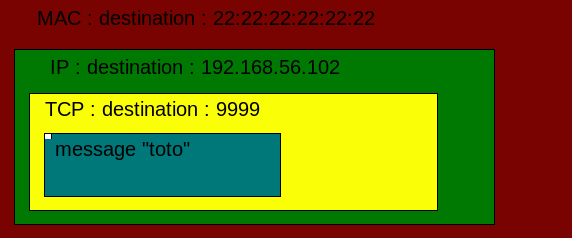

# B1 Réseau - Cours 5

* [Discuter sur un réseau](#discuter-sur-un-réseau)
* [Le protocole ARP](#arp)
  * [Concept](#a-concept)
  * [Quand est-ce que ARP est utilisé ?](#b-quand-est-ce-que-arp-est-utilisé-)
  * [ARP Request et ARP Reply](#c-arp-request-et-arp-reply)
  * [Adresse MAC de Broadcast](#d-adresse-mac-de-broadcast)
  * [Exemple concret](#e-exemple-concret)
* [Le principe de l'encapsulation](#le-principe-dencapsulation)

## Discuter sur un réseau

Quand vous êtes sur le même réseau :
* les IPs sont utilisées mais ne sont pas strictement nécessaires
* **pour joindre une machine sur le même réseau que vous, vous n'avez besoin QUE de son adresse MAC**

Si vous faites un `ping` (ou autres) vers une IP de votre réseau :
* vous allez avoir besoin de connaître la MAC qui se cache derrière cette IP
* pour ça, votre PC va utiliser le protocole ARP

## ARP

### A. Concept

**Le protocole ARP permet de faire la liaison entre adresses IP et adresses MAC.**

* pour joindre quelqu'un sur le même réseau que vous : **il vous faut connaître la MAC de ce "quelqu'un"**

* toutes les PCs/serveurs/routeurs/etc. possèdent une **table ARP**
  * elle contient les machine connues
  * une "machine connue" = on connaît son IP, et on connaît la MAC associée à cette IP

### B. Quand est-ce que ARP est utilisé ?

* si :
  * vous avez besoin de joindre quelqu'un sur le même réseau que vous
  * vous n'avez jamais joint ce quelqu'un auparavant
* alors :
  * il va vous falloir la MAC de ce quelqu'un (vous connaissez déjà l'IP)
  * pour connaître cette MAC, vous allez effectuer une requête **ARP Request**
  * la machine qui porte l'IP en question, vous répondra avec un **ARP Reply**

### C. ARP `request` et ARP `reply`

* **ARP request** (envoyé par "machine1") :
  * message très simple qui permet de demander la MAC quand on connaît l'IP
    * le message ressemble par exemple à : "SVP tout le monde, je suis l'IP 192.168.10.10, qui porte l'IP 192.168.10.1 ?"

* **ARP reply** (envoyé par "machine2") :
  * message très simple qui permet d'informer un hôte d'une association MAC <> IP
    * le message ressemble par exemple à : "Salut 192.168.10.10, c'est moi 192.168.10.1, ma MAC c'est ca:fe:ba:be:ca:fe"

* après cet échange
  * "machine1" connaît la MAC de "machine2"
  * "machine1" écrit dans sa **table ARP** la ligne suivante 
    * `192.168.10.1 : ca:fe:ba:be:ca:fe`

**Le protocole ARP permet de connaître les adresses MAC des machines sur un réseau donné**

### D. Adresse MAC de broadcast

* il existe une adresse  MAC "spéciale" : `ff:ff:ff:ff:ff:ff`
  * c'est l'adresse **MAC de broadcast**

* si vous envoyez un message à cette adresse MAC, **toutes les machines du réseau recevront le message**

* **quand vous envoyez un ARP Request, vous l'envoyez à l'addresse MAC de broadcast**
  * comme ça, tout le monde reçoit votre message
  * et parmi "tout le monde", y'a la personne qui vous intéresse
  * cette personne vous répondra

### E. Exemple concret

* deux machines sont connectées avec un câble (et c'est tout) :
  * les machines n'ont jamais communiqué

Machines | IP | MAC
--- | --- | ---
`host1` | `192.168.56.101/24` | `11:11:11:11:11`
`host2` | `192.168.56.102/24` | `22:22:22:22:22`

1. `host1` veut envoyer un `ping` à `host2`
2. `host1` tape la commande suivante :
    * `ping 192.168.56.102`
3. `host1` regarde sa table ARP
    * elle est vide
    * il ne connaît pas la MAC associée à `192.168.56.102`
4. `host1` effectue une requête ARP
    * `host1` envoie "Qui a l'IP `192.168.56.102` à `ff:ff:ff:ff:ff:ff`
    * `host2` reçoit le message et reconnaît que quelqu'un lui demande sa MAC
5. `host2` répond à la requête
    * `host2` envoie "C'est moi, `22:22:22:22:22:22` qui possède l'IP `192.168.56.102`
    * `host1` reçoit la réponse
6. `host1` ajoute une ligne dans sa table ARP
    * `host2 : 22:22:22:22:22:22`
7. `host1` fait partir son `ping` vers `22:22:22:22:22:22`

## Le principe d'encapsulation

> Bon, ça, sans un tableau blanc et un schéma, c'est chaud de faire un cours utile et clair. I'll try.

* le principe :
  * tout trafic TCP est encapsulé dans un paquet IP
    * le TCP a un port de destination
  * tout trafic IP est encapsulé dans une trame Ethernet
    * un paquet IP a une IP de destination
  * tout trafic Ethernet... est envoyé dans un câble (ou du WiFi)
    * une trame Ethernet a une MAC de destination

Regardez mes talents sous [Paint](https://jspaint.app/) : 

Sur le schéma ci-dessus : 
* c'est une trame qui circule sur le réseau
* c'est une trame à destination de : 
  * un port TCP 9999
  * l'IP `192.168.56.102`
  * la MAC `22:22:22:22:22:22`
* elle contient le message "toto"

* on reverra ça au prochain cours, une nouvelle fois, en détail 
